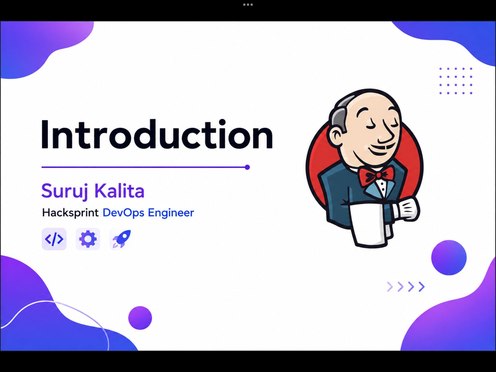

What is Jenkins?

Jenkins is an open-source automation server used to build, test, and deploy software. It helps developers automate repetitive tasks and manage the software development lifecycle efficiently.

Jenkins is written in Java, which makes it platform-independent and able to run on Windows, Linux, and macOS.

Is Jenkins Open Source?

Yes ✅
Jenkins is completely open-source and maintained by the community. Anyone can use, modify, and extend it freely.

 

Why Jenkins?

Jenkins is widely used because:

⚙️ Automates build and deployment processes
🔄 Saves time by reducing manual work
🔌 Supports thousands of plugins
🌍 Works on multiple platforms
🚀 Enables faster and more reliable releases

 

What is CI?

CI (Continuous Integration) is a practice where developers frequently push code changes to a shared repository.

Each change is automatically:

Built
Tested

This helps catch bugs early and keeps the code stable.

What is CD?

 

CD (Continuous Delivery / Continuous Deployment) is the next step after CI.

Continuous Delivery → Code is always ready to be deployed
Continuous Deployment → Code is automatically deployed to production without manual steps
🔗 How Jenkins Helps in CI/CD

Jenkins automates the entire CI/CD pipeline:

Pull code from repository
Build the application
Run tests
Deploy the application
